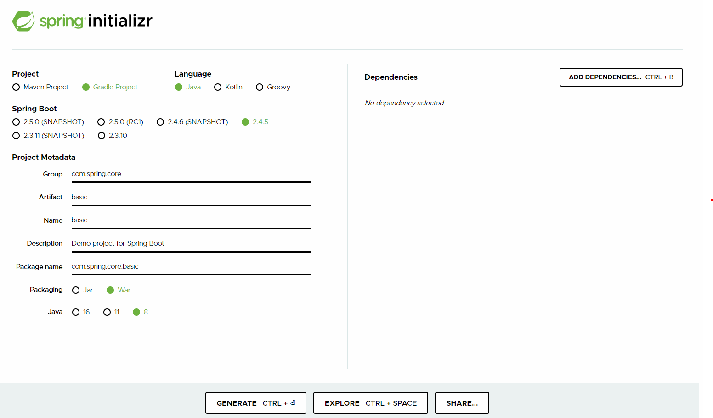

# 스프링 코어 학습
- [스프링 프로젝트 설정 링크](https://start.spring.io)
-  

#lombok 에러 해결 방법
1. 인텔리제이 플러그인 lombok 설치
2. 설정 -> 빌드, 실행, 배포 -> 컴파일러 -> 어노테이션 프로세서
=> 어노테이션 처리 활성화
3. build.gradle - dependencies에 추가
```groovy
compileOnly 'org.projectlombok:lombok:1.18.12'
annotationProcessor 'org.projectlombok:lombok:1.18.12'
```